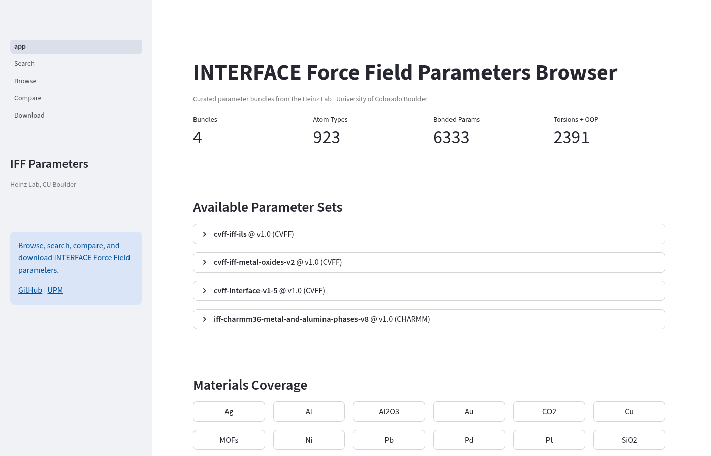
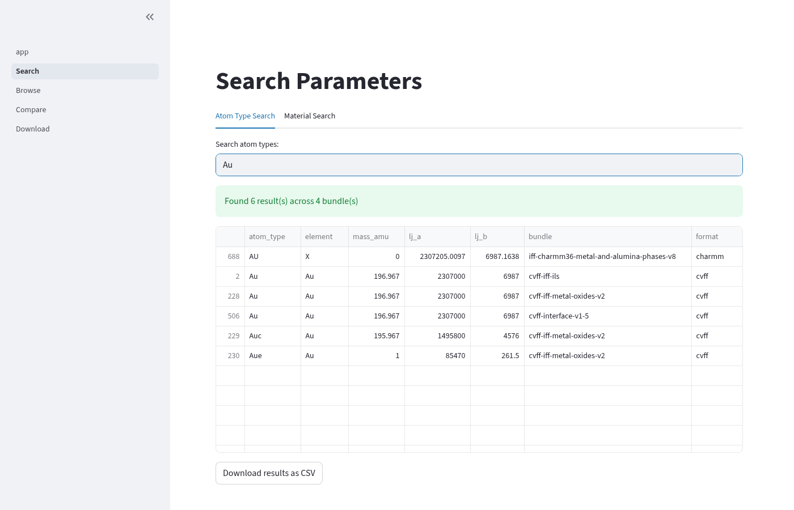
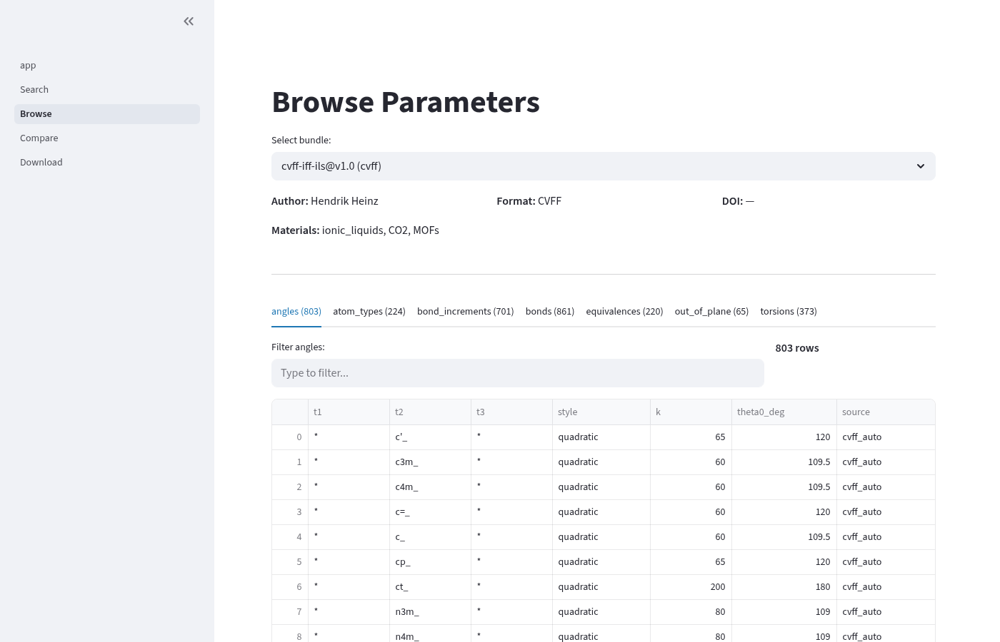
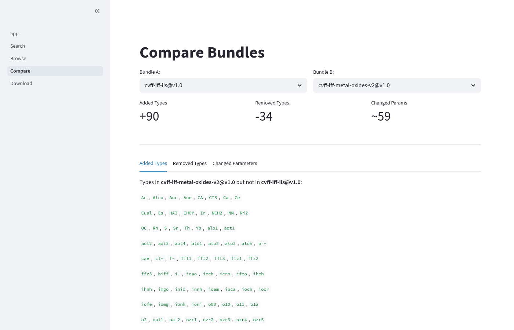
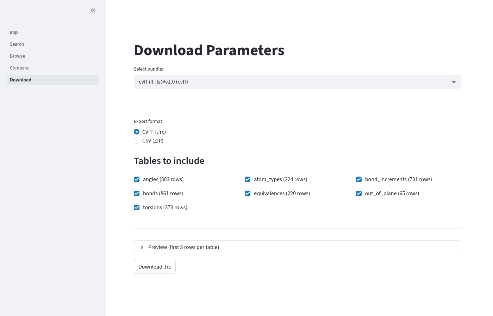
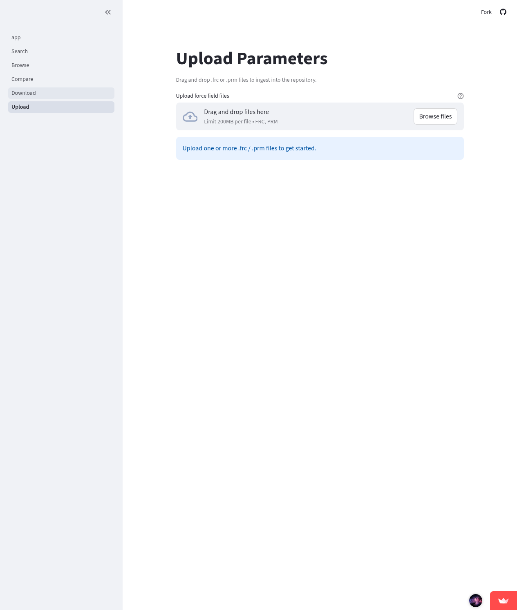

<h1 align="center">IFF Parameters</h1>

<p align="center">
  <strong>Curated, versioned parameter bundles for the INTERFACE Force Field</strong>
</p>

<p align="center">
  <a href="https://github.com/fl-sean03/iff-parameters/actions"></a>
  <a href="https://img.shields.io/badge/python-3.10%2B-blue"></a>
  <a href="https://img.shields.io/badge/code%20style-ruff-261230"></a>
  <a href="https://doi.org/10.1021/la3038846"></a>
</p>

<p align="center">
  Searchable, version-controlled force field parameters from the
  <a href="https://bionanostructures.com/">Heinz Lab</a> at CU Boulder.<br>
  Built on <a href="https://github.com/fl-sean03/upm">UPM v2.0</a> — the Unified Parameter Model toolkit.
</p>

---

## Why IFF Parameters?

The [INTERFACE Force Field (IFF)](https://github.com/hendrikheinz/INTERFACE-force-field-and-surface-models) provides thermodynamically consistent parameters for metals, minerals, and organic-inorganic interfaces — covering materials that standard force fields (CHARMM, AMBER, OPLS) don't handle well.

**This package solves three problems:**

| Problem | Solution |
|---------|----------|
| Parameter files scattered across laptops, Dropbox, HPC clusters | Single versioned repository with SHA256 integrity |
| "Which .frc file should I use for gold?" | `search_by_material("Au")` returns matching bundles |
| "What changed between v1 and v2 of the alumina parameters?" | `diff_tables(old, new)` shows exact parameter changes |

---

## Included Parameter Sets

| Bundle | Format | Materials | Atom Types | Reference |
|--------|--------|-----------|------------|-----------|
| `cvff-interface-v1-5` | CVFF | Ag, Al, Au, Cu, Ni, Pb, Pd, Pt, silica, clays | 180 | [Heinz 2013](https://doi.org/10.1021/la3038846) |
| `cvff-iff-metal-oxides-v2` | CVFF | Al₂O₃, SiO₂, clays, alumina | 280 | [Heinz 2013](https://doi.org/10.1021/la3038846) |
| `cvff-iff-ils` | CVFF | Ionic liquids, CO₂, MOFs | 224 | — |
| `iff-charmm36-metal-alumina-v8` | CHARMM | FCC metals, Al₂O₃, alumina | 239 | — |

> **923 total atom types** across 4 bundles, covering **16 materials** in both CVFF (.frc for LAMMPS) and CHARMM (.prm for NAMD/OpenMM) formats.

---

## Quick Start

### Install

```bash
pip install git+https://github.com/fl-sean03/upm.git
pip install git+https://github.com/fl-sean03/iff-parameters.git
```

### Find Parameters for Your Material

```python
from iff_parameters import search_by_material

# "I need parameters for gold"
for result in search_by_material("Au"):
    print(f"{result['name']} ({result['format']}) — {result['materials']}")
```
```
cvff-interface-v1-5 (cvff) — ['Ag', 'Al', 'Au', 'Cu', 'Ni', 'Pb', 'Pd', 'Pt', 'silica', 'clays']
iff-charmm36-metal-alumina-v8 (charmm) — ['Ag', 'Al', 'Au', 'Cu', 'Ni', 'Pb', 'Pd', 'Pt', 'Al2O3', 'alumina']
```

### Browse All Available Parameters

```python
from iff_parameters import list_available

for entry in list_available():
    print(f"{entry['name']}@{entry['version']} — {len(entry['materials'])} materials")
```

### Search by Atom Type (Cross-Bundle)

```python
from upm.registry import discover_local_packages, PackageIndex
from iff_parameters import get_data_dir

index = PackageIndex(discover_local_packages(get_data_dir()))
results = index.search_atom_type("Au")

for r in results:
    print(f"  {r.package_name}: LJ_A={float(r.row['lj_a']):.0f}")
```

### Compare Two Parameter Sets

```python
from upm.registry import diff_tables
from upm.bundle.io import load_package
from iff_parameters import get_data_dir

pkg1 = load_package(get_data_dir() / "cvff-interface-v1-5" / "v1.0")
pkg2 = load_package(get_data_dir() / "cvff-iff-metal-oxides-v2" / "v1.0")

diff = diff_tables(pkg1.tables, pkg2.tables)
print(diff.summary())
# Added types (101): AC1, ALO1, FE_2, OC23, SC4, ...
# Changed parameters (10):
#   atom_types[Cr].lj_a: 589600.0 → 1222517.4
```

---

## Web Dashboard

**Live:** [iff-parameters-hhl.streamlit.app](https://iff-parameters-hhl.streamlit.app)

Or run locally:

```bash
cd dashboard && streamlit run app.py
```

<p align="center">
  
  <br><em>Home — parameter set overview with metrics and materials coverage</em>
</p>

<p align="center">
  
  <br><em>Search — find atom types across all bundles (showing Au results)</em>
</p>

<p align="center">
  
  <br><em>Browse — detailed parameter tables with filtering and CSV export</em>
</p>

<details>
<summary><strong>More screenshots</strong></summary>

<p align="center">
  
  <br><em>Compare — side-by-side diff showing +90 added, -34 removed, ~59 changed parameters</em>
</p>

<p align="center">
  
  <br><em>Download — export as CVFF .frc, CHARMM .prm, or CSV with table selection</em>
</p>

<p align="center">
  
  <br><em>Upload — drag-and-drop .frc/.prm files with auto-parsing, similarity detection, and one-click ingest</em>
</p>

</details>

---

## Adding New Parameters

### Single File Ingest

```bash
python scripts/ingest.py \
    --path my_forcefield.frc \
    --name my-ff-name \
    --version v1.0 \
    --author "Your Name" \
    --materials "Au,Cu,SiO2" \
    --notes "Optimized for solvation free energy"
```

The script automatically compares against existing bundles and flags near-duplicates:

```
Similarity Analysis (2 similar bundle(s) found):
  cvff-interface-v1-5@v1.0: 91.4% overlap
    Common: 170 types | Added: +10 | Changed: ~3
    → RECOMMENDATION: This extends cvff-interface-v1-5.
```

### Batch Ingest (Scan a Directory)

```bash
# Preview what would be ingested
python scripts/batch_ingest.py --scan-dir ~/Dropbox/forcefields/ --dry-run

# Ingest all unique files (duplicates auto-skipped by SHA256)
python scripts/batch_ingest.py --scan-dir ~/Dropbox/forcefields/
```

### Validate All Bundles

```bash
python scripts/validate.py
# All 4 bundle(s) passed.
```

See [CONTRIBUTING.md](CONTRIBUTING.md) for the full contribution workflow (branch → PR → CI → review).

---

## Provenance & Integrity

Every parameter bundle tracks complete provenance:

| Field | Description | Example |
|-------|-------------|---------|
| `author` | Who created this set | Hendrik Heinz |
| `source_sha256` | Cryptographic hash of source file | `9c1f7aff...` |
| `publication_doi` | Associated publication | `10.1021/la3038846` |
| `parent_ff` | Base force field extended | `cvff_interface_v1_5` |
| `materials` | Covered materials | `["Au", "SiO2", "clays"]` |
| `ingested_utc` | When added to repository | `2026-03-24T21:00:26Z` |

Bundles are verified on every CI run via `scripts/validate.py` — SHA256 hashes, manifest integrity, and table completeness are checked automatically.

---

## Architecture

```
iff-parameters/
├── src/iff_parameters/
│   ├── __init__.py          # list_available(), search_by_material(), get_data_dir()
│   ├── _provenance.py       # Provenance schema + canonical defaults
│   └── data/                # Versioned parameter bundles
│       └── <name>/<version>/
│           ├── manifest.json    # SHA256 provenance + metadata
│           ├── tables/*.csv     # Canonical parameter tables
│           └── raw/source.frc   # Original source file
├── scripts/
│   ├── ingest.py            # Single-file ingest with similarity detection
│   ├── batch_ingest.py      # Directory scan with SHA256 deduplication
│   └── validate.py          # Bundle integrity verification
├── dashboard/               # Streamlit web interface
└── tests/                   # Unit + integration tests
```

Integrates with [UPM v2.0](https://github.com/fl-sean03/upm) via Python entry points (`upm.data_packages` group). UPM's `discover_packages()` auto-discovers installed bundles — no manual configuration required.

---

## Citation

If you use these parameters in published work, please cite:

> Heinz, H.; Lin, T.-J.; Mishra, R. K.; Emami, F. S. "Thermodynamically Consistent Force Fields for the Assembly of Inorganic, Organic, and Biological Nanostructures: The INTERFACE Force Field." *Langmuir* **2013**, 29, 1754–1765. [DOI: 10.1021/la3038846](https://doi.org/10.1021/la3038846)

Individual bundles may have additional citations — check `manifest.json → provenance → publication_doi` for each bundle.

---

## Related Projects

| Project | Description |
|---------|-------------|
| [UPM](https://github.com/fl-sean03/upm) | Unified Parameter Model — toolkit for parsing, validating, and exporting .frc and .prm files |
| [USM](https://github.com/fl-sean03/usm) | Unified Structure Model — atomistic structure I/O (CAR, MDF, CIF, PDB) |
| [INTERFACE FF](https://github.com/hendrikheinz/INTERFACE-force-field-and-surface-models) | Official IFF v1.5 parameter files from the Heinz Lab |

---

<p align="center">
  <sub>Developed at the <a href="https://bionanostructures.com/">Heinz Lab</a>, University of Colorado Boulder</sub>
</p>
